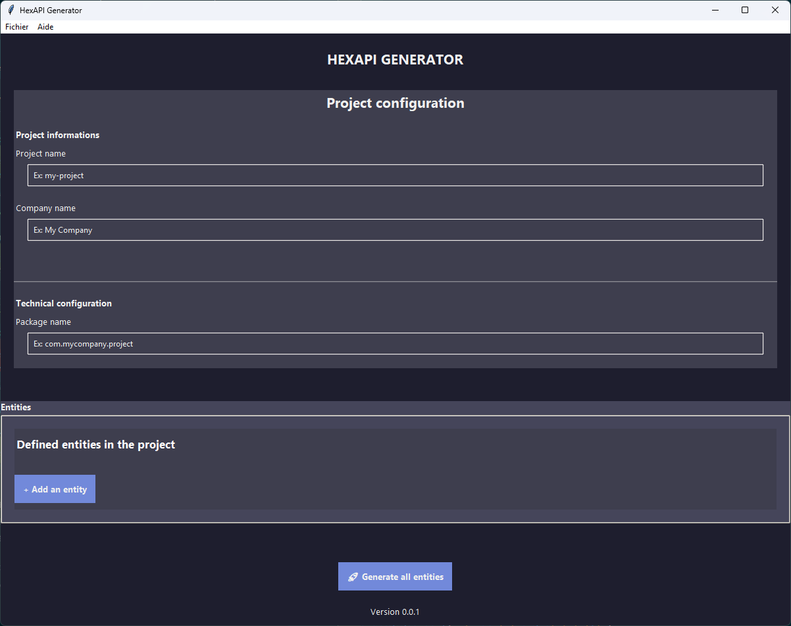
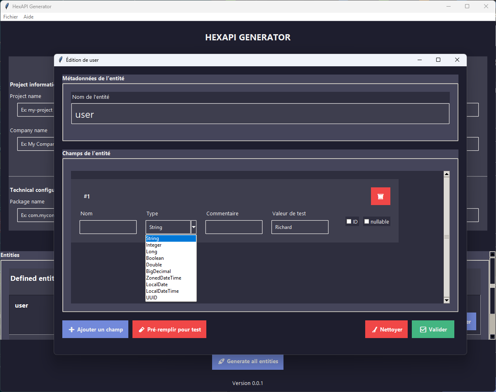
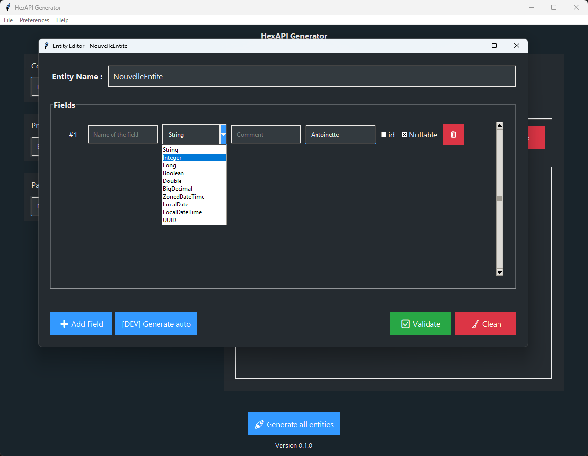

[](https://github.com/Bertrand2808/Hexapi/actions/workflows/python.yml)
[](https://github.com/Bertrand2808/Hexapi)
[](https://www.python.org/downloads/)

# HexAPI Generator

> Générateur d'API Java avec architecture hexagonale - De l'idée au code en quelques clics

Un outil de génération de code intelligent qui transforme vos définitions d'entités en une architecture hexagonale Java complète et prête à l'emploi. Conçu pour accélérer le développement et garantir les bonnes pratiques architecturales.

## 🌟 Pourquoi HexAPI Generator ?

- **⚡ Gain de temps** : Générez en quelques minutes ce qui prendrait des heures à coder manuellement
- **🏗️ Architecture solide** : Respect automatique des principes de l'architecture hexagonale
- **🎨 Interface intuitive** : Définissez vos entités sans écrire une ligne de code
- **📋 Code de qualité** : Génération avec Javadoc, annotations et bonnes pratiques
- **🔧 Prêt à l'emploi** : Architecture complète directement utilisable

## ✨ Fonctionnalités

### Interface Graphique

- 🎯 Éditeur visuel d'entités avec validation en temps réel
- 📊 Gestion des relations entre entités (OneToMany, ManyToOne, etc.)
- 🎨 Interface moderne et intuitive

### Génération de Code

- 📦 **Entities** : Classes métier avec annotations JPA et validation
- 🔄 **Mappers** : Transformation automatique entre couches
- 🌐 **Controllers** : API REST avec documentation OpenAPI
- 🔌 **Adapters** : Implémentations des ports secondaires
- 📚 **Ports** : Interfaces de l'architecture hexagonale

## A venir

- 🧪 **Tests** : Tests unitaires et d'intégration générés

## 🚀 Démarrage rapide

### Prérequis

- Python 3.8+
- Java 11+ (pour le code généré)

### Installation

```bash
# 1. Cloner le projet
git clone https://github.com/Bertrand2808/Hexapi.git
cd Hexapi

# 2. Configurer l'environnement Python
python -m venv .venv
source .venv/bin/activate  # Linux/Mac
# ou
.\.venv\Scripts\activate   # Windows

# 3. Installer les dépendances
pip install -r requirements.txt

# 4. Lancer l'application
python main.py
```

### Utilisation

1. **Définir vos entités** : Utilisez l'interface graphique pour créer vos entités métier
2. **Configurer les relations** : Définissez les liens entre vos entités
3. **Générer le code** : Cliquez sur "Générer" pour créer votre architecture
4. **Récupérer le projet** : Votre API Java est prête dans le dossier `output/`

## 📸 Aperçu

<div align="center">

### Interface principale





### Éditeur d'entité




</div>

## 🏗️ Architecture générée

```
votre-api/
├── src/main/java/
│   ├── domain/
│   │   ├── entities/          # Entités métier
│   │   └── ports/             # Interfaces (ports)
│   ├── infrastructure/
│   │   ├── adapters/          # Implémentations
│   │   ├── controllers/       # API REST
│   │   └── mappers/           # Transformations
│   └── application/
│       └── services/          # Services métier
├── src/test/java/             # Tests générés
└── pom.xml                    # Configuration Maven
```

## 🛠️ Développement

### Structure du projet

```
hexapi/
├── generator/              # Moteur de génération
│   ├── gui/               # Interface graphique (Tkinter)
│   ├── templates/         # Templates Jinja2
│   ├── models/            # Modèles de données
│   └── utils/             # Utilitaires
├── output/                # Projets générés
├── tests/                 # Tests du générateur
└── docs/                  # Documentation
```

### Générer un exécutable

```bash
python setup.py build
```

### Tests et qualité

```bash
# Tests unitaires
python -m pytest

# Analyse de code
python -m flake8 generator/
```

## 🔧 Configuration

Le générateur supporte plusieurs options de configuration :

- **Framework** : Spring Boot (par défaut)
- **Base de données** : H2, PostgreSQL, MySQL
- **Build tool** : Maven, Gradle
- **Version Java** : 11, 17, 21

## 📋 Exemple d'utilisation

Créez une entité `User` avec les champs `name`, `email`, et le générateur produira automatiquement :

- `User.java` (entité JPA)
- `UserController.java` (API REST)
- `UserService.java` (logique métier)
- `UserRepository.java` (accès données)
- `UserMapper.java` (transformations)
- Tests unitaires associés

## 🤝 Contribution

Les contributions sont les bienvenues !

1. Fork le projet
2. Créez votre branche (`git checkout -b feature/amazing-feature`)
3. Committez vos changements (`git commit -m 'Add amazing feature'`)
4. Push sur la branche (`git push origin feature/amazing-feature`)
5. Ouvrez une Pull Request

## 📄 Licence

Ce projet est sous licence Apache 2.0. Voir le fichier [Licence](Licence.md) pour plus de détails.

## 👥 Auteur

**Bertrand2808** - _Créateur et mainteneur_ - [GitHub](https://github.com/Bertrand2808)

## 🙏 Remerciements

- Inspiré par les principes de l'architecture hexagonale d'Alistair Cockburn
- Communauté Spring Boot pour les bonnes pratiques
- Tous les contributeurs qui ont participé au projet

---
